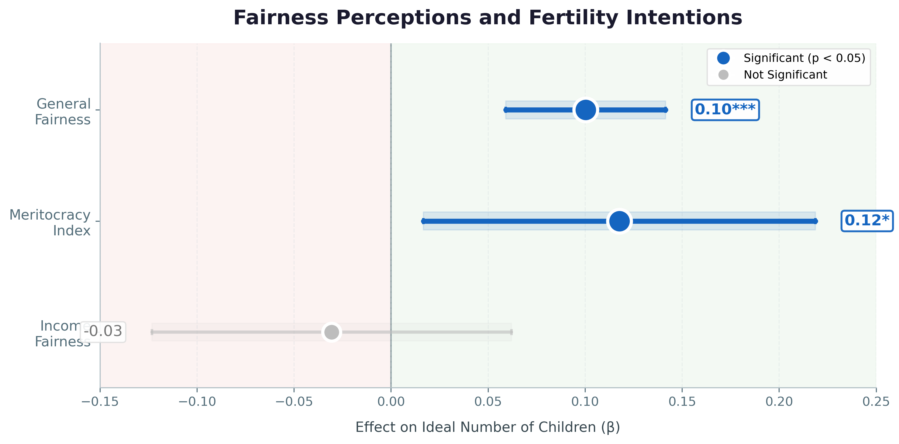

# Fair Play, Over Fair Play? Perceived Fairness and Fertility Intentions in China

**Chinese young adults probably aren't refusing children because they don't have enough money to raise them — they're refusing because the game feels rigged.**

Using the 2023 Chinese General Social Survey (CGSS), this project shows that **procedural** fairness (is the system fair? does effort pay off?) is associated with how many children young adults want, while **distributive** fairness (are incomes equal?) is not. China's total fertility rate has fallen to 1.09 despite the removal of all birth limits, so understanding the subjective drivers of fertility matters for policy. 

This little research was proudly built for the capstone project Applied Data Institute '25 cohort at [Equitech Futures](equitechfutures.com).



## Key findings

| Finding | Evidence |
| --- | --- |
| Procedural fairness is associated with fertility intentions | General fairness **β = 0.100** (p < 0.001); meritocracy **β = 0.118** (p = 0.024) |
| Distributive fairness is not | Income fairness **β = −0.031** (n.s.) |
| A sharp generational gap | Gen Z **1.22** vs Millennials **1.79** ideal children (Cohen's d = 0.56) |
| Urban and rural respond to different signals | Urban → general fairness (β = 0.117); rural → meritocracy (β = 0.201) |
| Men show stronger effects than women | General fairness: men **0.119**, women **0.076** |

> **Important:** these are **associations from cross-sectional data**, not causal effects, and *ideal number of children* is a stated intention, not a birth. See the paper's Limitations section.

## Reproduce in three steps

```bash
make install        # install pinned dependencies (or: pip install -r requirements.txt)
# place the CGSS 2023 microdata at data/CGSS2023.csv — see data/README.md
make all            # regenerate tables, figures, and web data
```

`make quick` runs a fast M = 3 smoke test. The full pipeline reproduces the
appendix tables in `outputs/` to three decimal places.

## Repository structure

```
src/                  Modular analysis pipeline
  config.py             paths, constants, variable lists, palette
  data_prep.py          load CGSS + construct variables
  imputation.py         multiple imputation (M = 20, Rubin's rules)
  descriptives.py       descriptive + bivariate statistics
  models.py             pooled OLS / Poisson / NegBin, stratified, interactions
  figures.py            editorial figures (driven by the model results)
  export_web.py         pre-aggregated JSON for the website
run_analysis.py       one-command orchestrator
notebooks/            Narrative notebook (imports the same logic)
outputs/              Figures + appendix tables
site/data/            Aggregated JSON powering the data-story website
paper/                Final paper (markdown)
data/                 Codebooks + questionnaires (microdata not included)
```

## Methods

- **Sample:** CGSS 2023 respondents born 1980 or later (Millennials + Gen Z), N = 4,889.
- **Missing data:** the split-questionnaire design leaves 53–73% missing on the
  fairness items; addressed with multiple imputation (M = 20) pooled via Rubin's rules.
- **Main models:** OLS with HC3 robust standard errors.
- **Robustness:** Poisson and Negative Binomial count models.
- **Heterogeneity:** stratified analyses by gender and urban/rural residence, plus
  formal interaction tests with Benjamini-Hochberg FDR correction.

## Data

The CGSS microdata is **not redistributed** in this repository (it requires free
registration). The codebooks and questionnaires are included. See
[`data/README.md`](data/README.md) for how to obtain the data and where to place it.

## Citation

If you reference this work, please cite the paper in
[`paper/ADI2025_CapstoneResearch_Sinyu-2.md`](paper/ADI2025_CapstoneResearch_Sinyu-2.md),
and cite CGSS per the survey provider's requirements.
